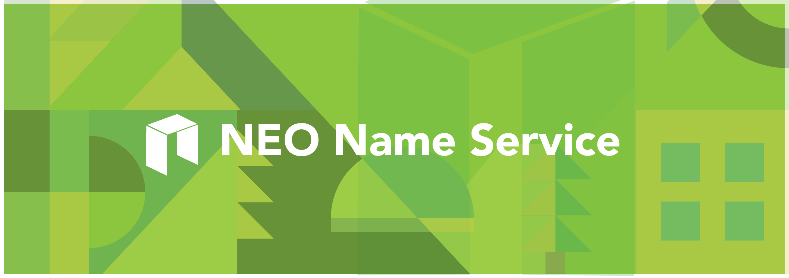

> 📗🌐 Documents and implementations for the NEO Name Service.

## 📝 Description

NNS is the NEO Name Service, a distributed, open, and extensible naming system based on the NEO blockchain.

## 📚 Documents

#### Table of Contents
-  [Introduction](./docs/INTRODUCTION.md)
-  [Implementation](./docs/IMPLEMENTATION.md)
    - [Registry](./docs/REGISTRY.md)
    - [Registrar](./docs/REGISTRAR.md)
    - [Resolver](./docs/RESOLVER.md)
    - [ReverseRegistrar](./docs/REVERSE_REGISTRAR.md)
-  [Developer Guide](./docs/DEVELOPER_GUIDE.md)
-  [Integration](./docs/INTEGRATION.md)

## 📣 Contributing
See [CONTRIBUTING.md](./CONTRIBUTING.md) for how to help out.

## 🗒 Licence
See [LICENSE](./LICENSE) for details.
