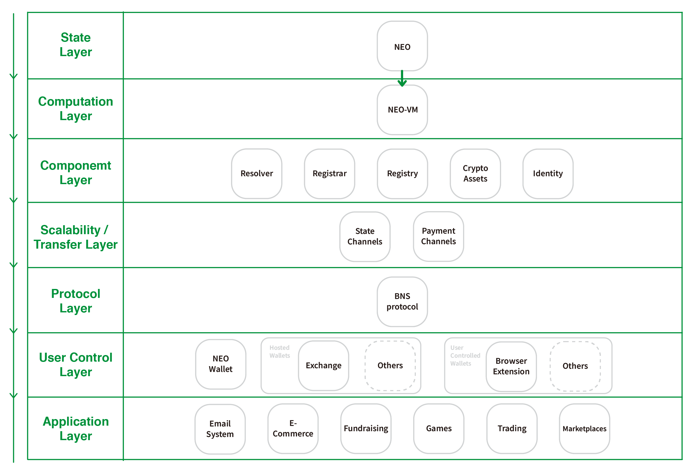
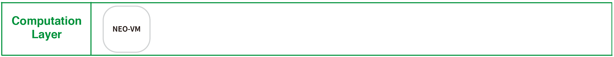
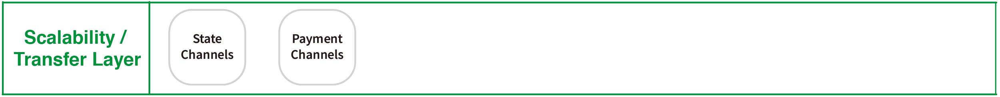
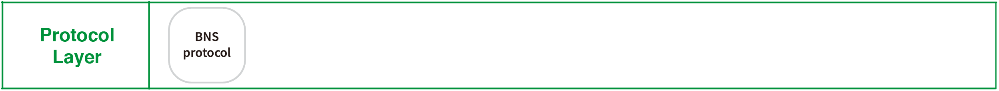

[](https://gitter.im/PortalNetwork/nns?utm_source=badge&utm_medium=badge&utm_campaign=pr-badge&utm_content=badge)

> 📗🌐 Documents and implementations for the NEO Name Service.

## What is NEO?
NEO is a non-profit community-driven blockchain project. It utilizes blockchain technology and digital identity to digitize assets and automate the management of digital assets using smart contracts. Using a distributed network, it aims to create a "Smart Economy".

## What is BNS?
BNS – or blockchain name system – is the protocol on the internet that turns human-comprehensible decentralized website names such as ‘website.perl’ or ‘mywebsite.eth’ into addresses understandable by decentralized network machines.

## 📝 Description

NNS is the NEO Name Service, a distributed, open, and extensible naming system based on the NEO blockchain.

## 📚 Documents

#### Table of Contents
-  [Introduction](./docs/INTRODUCTION.md)
-  [Implementation](./docs/IMPLEMENTATION.md)
    - [Registry](./docs/REGISTRY.md)
    - [Registrar](./docs/REGISTRAR.md)
    - [Resolver](./docs/RESOLVER.md)
-  [Developer Guide](./nns/README.md)
-  [Integration](./docs/INTEGRATION.md)

## Smart Contract Language
- Python
- C#
- Java

## 📍 NNS in Web3.0
NNS plays an connecting and entry layer in Web3.0 services. It connects with NEO wallet, blockchain server, decentralized content resources, and decentralized database.


## NEO Technical Stack
NEO Name Service (NNS) is governs by three smart contract components, registrar, registry, and resolver. The three smart contracts contain the core logic for the whole NEO Name System implementation, from the ownership managment for a domain, to the NNS global resolving layer that can connect different tech stacks and enhances the usability for different infrastructures.


### State Layer
State layer is where user’s “state”, or user’s information and behavior, is stored. NEO is where these data are stored, and gives users the ability to control their own state.


### Computation Layer
NEO is aiming to support all of the high-level programming language and NeoVM is the virtual machine that executes these NEO smart contract codes. The NEO-VM is composed with the `Execution Engine`, `Evaluation Stack`, and `Interoperable Service Layer`. The `Execution Engine` is in charge of executing common instructions and interacting with the `Interoperable Service Layer`. The `Evaluation Stack` is equivalent to the memory, and `Interoperable Service Layer` is equivalent to the peripherals, which provides some APIs for accessing the chain-chain data (block info, transaction info, contract info and so on) of the smart contract.


### Component Layer
With the combination of state layer and computation layer, many things could be implemented in the component layer. NNS, for instance, consists 3 major components — `registrar`, `registry` and `resolver`. These components make sure that NNS is operable and could meet the specific needs of each individual.

A `registry` can operate the set of logics to record the mapping between the NEO domains and its owners. 
A `registrar` can govern how to own a domain through the customized auction or trading rules. 
A `resolver` can retrieve the corresponding resources from wallet address to decentralized application or website on top of NEO.


### Transfer Layer
Just as Lightning Network offers solution to scale for Bitcoin, and Raiden Network (RDN) for Ethereum, Trinity Network (TNC) offers the `state channel` (identical to `payment channel`)for NEO to scale off-chain. It acts as a ledger between two parties, where only the end result of a transaction is recorded on the blockchain.


### Protocol Layer
On the Protocol Layer, we will be presenting our BNS (Blockchain Name Service) standards that can make the NNS more efficient and applicable. With the state, computation and component layers behind the scene, protocol layer serve as a gateway for users and developers to interact with our NNS standard.


### User Control Layer
This layer is in charge of managing a user’s private keys and the interaction with the State Layer. This enables more use cases around NNS at the application layer. For example, our Web Builder let users to create their own decentralized websites (DWebs) binded with an NNS, and a further enhancement on our extension could be used to access these DWebs with ease at “yourwebsite.neo”.


### Application Layer
NNS can be implemented into many other applications on NEO, such as wallet that can resolve NNS, dApp that utilize NNS for users identity and many more. Together with the off-chain scaling solution provided by Trinity Network, we believe that it is an essential components to provide a better environment for both technical and non-technical users.


## NEO Smart Contract Development

#### Smart Contract of NNS
- [C#](./nns/dotnet/)
- [Python](./nns/python/)

### Prerequisites
- `Docker` installed, download [HERE](https://download.docker.com/mac/stable/Docker.dmg).

### Build using docker
1. Execute command to start docker.
```
docker run -d --name neo-privnet-with-gas -p 20333-20336:20333-20336/tcp -p 30333-30336:30333-30336/tcp -v "$(pwd)":/opt/neo-python/smartContracts metachris/neo-privnet-with-gas
```

2. Start NEO private net through docker
```
docker exec -it neo-privnet-with-gas /bin/bash
```  


3. Run NEO private net
```
python3 /opt/neo-python/prompt.py -c protocol.privnet.json
``` 


4. Create wallet (i.e. portalnetwork.wallet)
```
neo> create wallet portalnetwork.wallet
```


5. At this moment, `portalnetwork.wallet` has no NEO and GAS.   
But you can also run this command to import NEO and GAS.  
```
neo> import wif KxDgvEKzgSBPPfuVfw67oPQBSjidEiqTHURKSDL1R7yGaGYAeYnr
neo> wallet rebuild
neo> wallet
```


6. Exit NEO private net and go to your NEO smart contract project folder.   
Copy your smart contract files to NEO's private net container.
```
docker cp domain.py [container id]:/opt/neo-python/contract/domain.py
```

7. Back into docker, use `neo-boa` build python to avm. run `python3` and execute two command
```
from boa.compiler import Compiler
Compiler.load_and_save('one.py')
``` 


8. Execute NEO private net 
```
python3 /opt/neo-python/prompt.py -c protocol.privnet.json
```

9. Before deploy contract, you should open the wallet. 
```
open wallet portalnetwork.wallet
```

10. Now you can deploy contract 
```
neo> import contract ./contract/domain.avm "" 01 False False
```


11. Search the contract
```
neo> contract search [your contract name]
```

12. Test and invoke contract via the command below
```
neo> testinvoke 68ebfc4fefbe24c9cff0f7e3c0d27ed396d07f9f
```


## 🔗 Resources
- [Official website](https://neo.org/)
- [NEO Documentation](http://docs.neo.org/en-us/index.html)

## 📣 Contributing
See [CONTRIBUTING.md](./CONTRIBUTING.md) for how to help out.

## 🗒 Licence
See [LICENSE](./LICENSE) for details.
